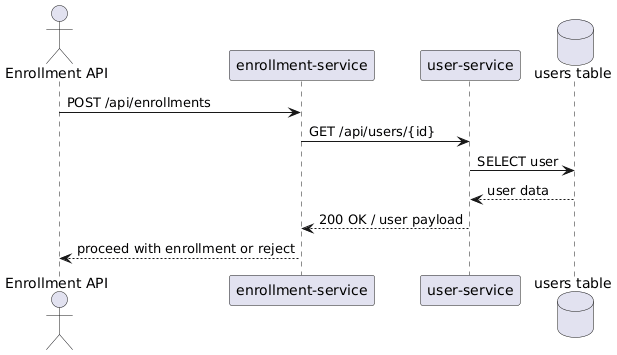
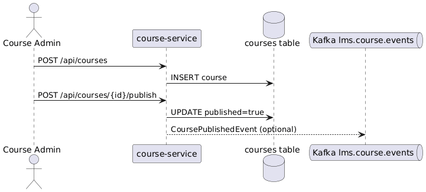
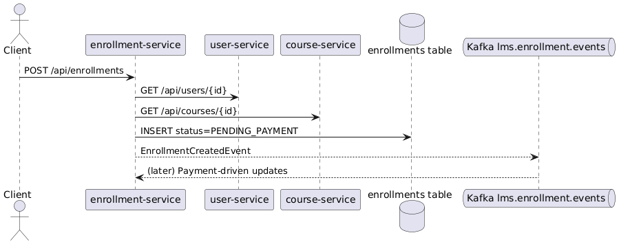
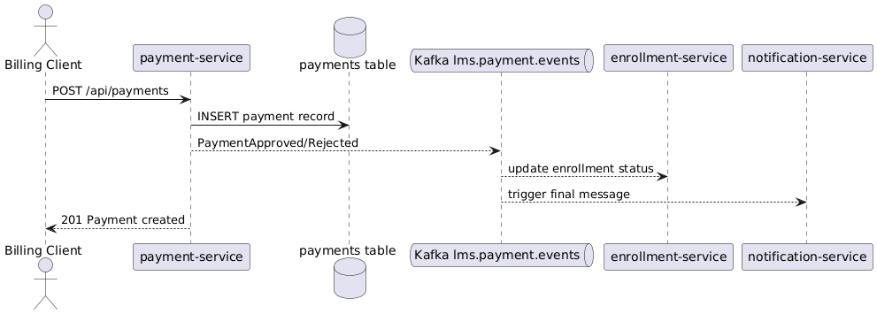
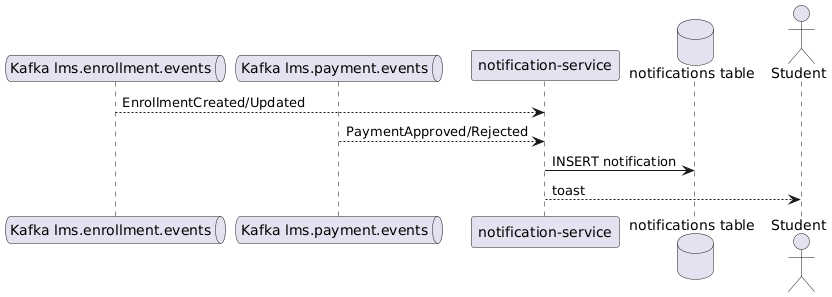
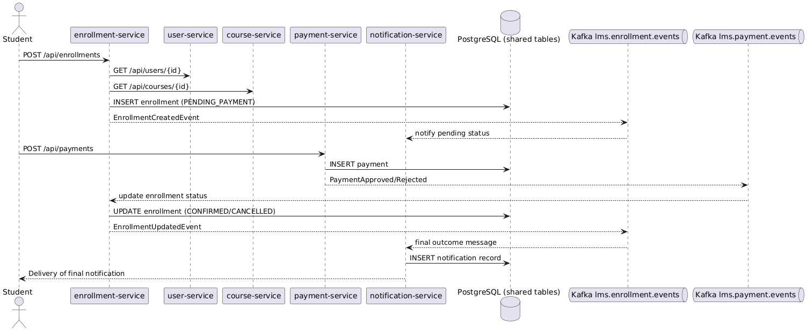

# modulo 2 final

## Infrastructure

| Component | Host Port | Container Port |
| --- | --- | --- |
| Zookeeper | 2181 | 2181 |
| Kafka | 9092 | 9092 |
| Kafka UI | 8090 | 8080 |

Kafka bootstrap server (internal): `kafka:29092`

---

## Tables

| Service | Database | Host Port | User | Password |
| --- | --- | --- | --- | --- |
| user-service | userdb | 5432 | lms | lms |
| course-service | coursedb | 5432 | lms | lms |
| enrollment-service | enrollmentdb | 5432 | lms | lms |
| payment-service | paymentdb | 5432 | lms | lms |
| notification-service | notificationdb | 5432 | lms | lms |

---

## Microservices

| Microservice | Host Port | Internal Port | Description |
| --- | --- | --- | --- |
| user-service | 8080 | 8080 | User validation and lookup |
| course-service | 8081 | 8080 | Course management |
| enrollment-service | 8082 | 8080 | Enrollment orchestration |
| payment-service | 8083 | 8080 | Payment processing |
| notification-service | 8084 | 8080 | Notification handling |

---

## Communication

### REST (Synchronous)

- enrollment-service → user-service
- enrollment-service → course-service

### Kafka (Asynchronous)

- enrollment-service → lms.enrollment.events
- payment-service → lms.payment.events
- notification-service consumes both topics

## user service

## course service

## enrollment service

## payment service

## notification service

## complete flow

